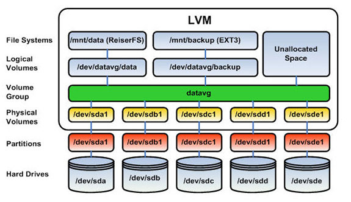
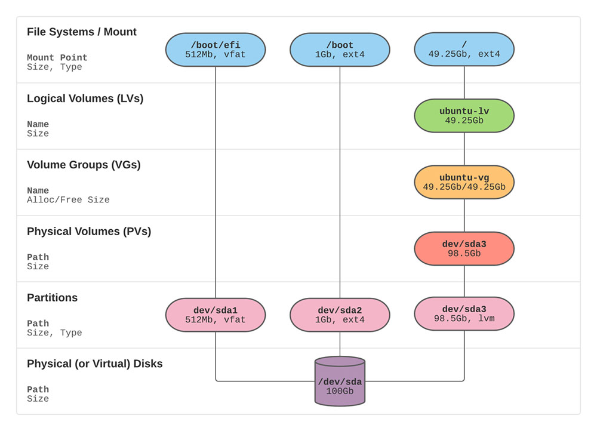

# Increase LVM Partition Size

## Overview

By default, Ubuntu installer uses only portion of disk space for the root file system! This guide is to explain how to extend and utilize the full disk space after installation.

## Linux LVM

LVM is an abstraction framework which exists between the physical (or virtual) disks and the Linux file system (which is likely `ext4`). It is used to group separate block devices (partitions) together into Volume Groups (VGs), and then chop those VGs up into logical block devices, or Logical Volumes (LVs). LVs are the abstracted block devices upon which your usable file system resides.





## Steps

* Open Terminal
* View the Volume Groups

```bash
sudo vgdisplay
```

* View the Logical Volume

```bash
sudo lvdisplay
```

Extend the Logical Volume

```bash
sudo lvextend -l +100%FREE /dev/ubuntu-vg/ubuntu-lv
```

* Verify the Changes

```bash
sudo lvdisplay
```

* View the File System

```bash
df -h
```

* Extend the File System

```bash
sudo resize2fs /dev/mapper/ubuntu--vg-ubuntu--lv
```

* Verify the Changes

```bash
df -h
```

## References

1. <https://packetpushers.net/blog/ubuntu-extend-your-default-lvm-space/>
